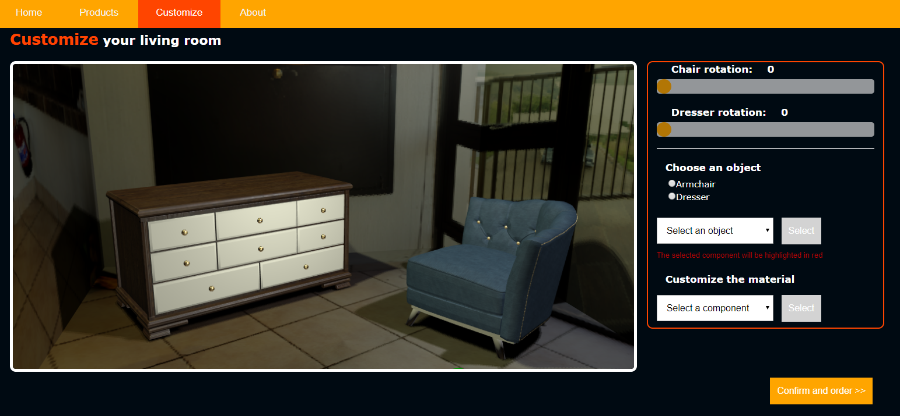

# PRODUCT CONFIGURATION PROJECT

Il progetto consiste nella realizzazione di un prototipo di visualizer di prodotti online.

La scelta dei modelli è ricaduta nell'ambito dell'arredamento di interni, per la più vasta gamma di modelli reperibili e per la relativa semplicita degli stessi. Essendo necessario dividere i modelli in più componenti/mesh a cui attribuire i diversi materiali, anche lavorando con programmi di modellazione 3d, è stato molto più intuitivo lavorare con dei mobili anzichè modelli più complessi come automobili o utensili/arnesi di altro tipo.

Entrambi i modelli sono stati reperiti dai siti https://www.cgtrader.com/ e https://www.turbosquid.com/ che mettono a disposizione una vasta libreria di modelli low poly gratuiti in diversi formati (utilizzato l'OBJ). Qualche modifica per la suddivisione in mesh e l'alleggerimento dei poligoni è stata effettuata con l'uso di Autodesk Maya 2018.

Il risultato finale è un visualizer che propone a schermo due ipotetici pezzi di arredamento scelti da un catalogo online, e prima dell'acquisto finale permette una visualizzazione più realistica e nel dettaglio dei prodotti. Permette anche una personalizzazione dei materiali, per rendere più consono il mobile all'arredamento desiderato dall'utente.

È possibile infatti ruotare gli oggetti per poterli vedere a 360°, con un'illuminazione che permette di rendere visibili riflessi, superfici ruvide ed evidenziare i dettagli dei mobili.

Le texture dei materiali (legno e pelle) sono prese da https://www.cc0textures.com/ e https://www.wood-database.com/ come texture con licenza libera, poi applicate trammite lo shader programmato. Mentre i materiali metallici e quello plastico sono realizzati unicamente tramite shader custom.

La selezione 
