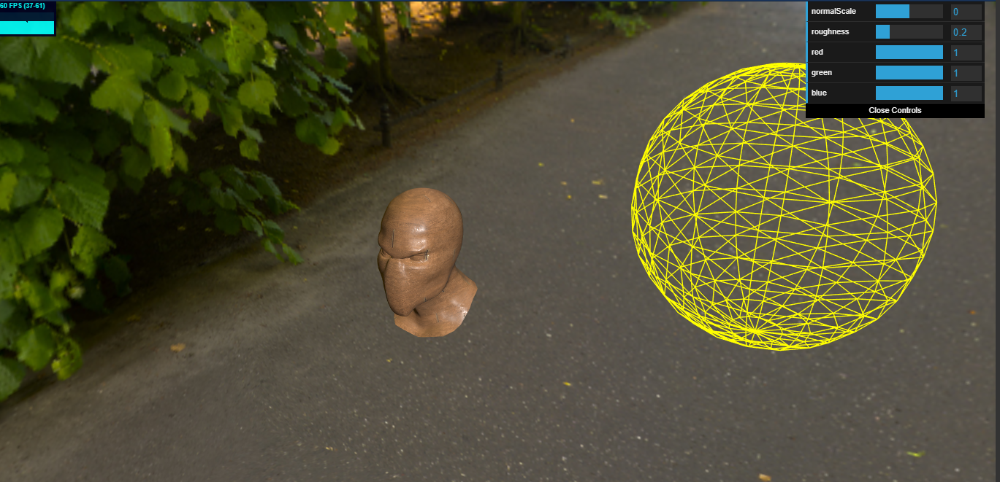
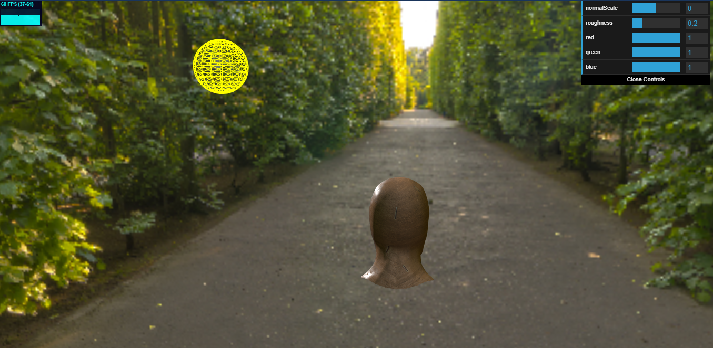
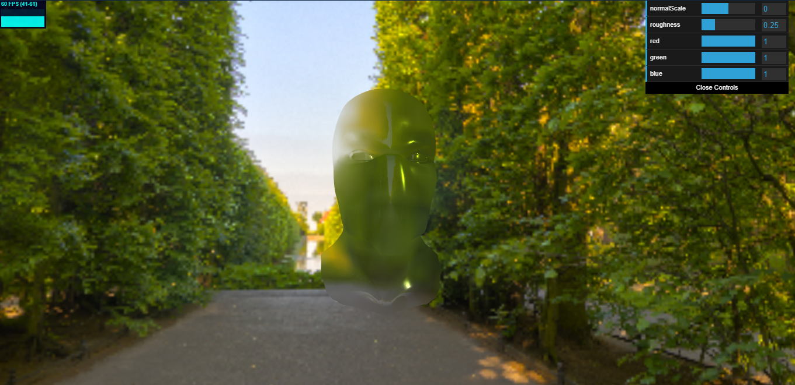
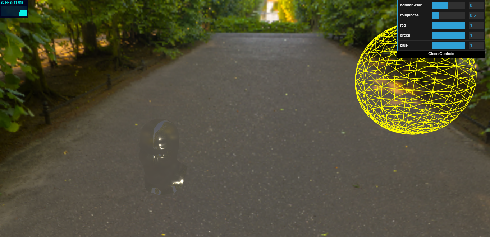
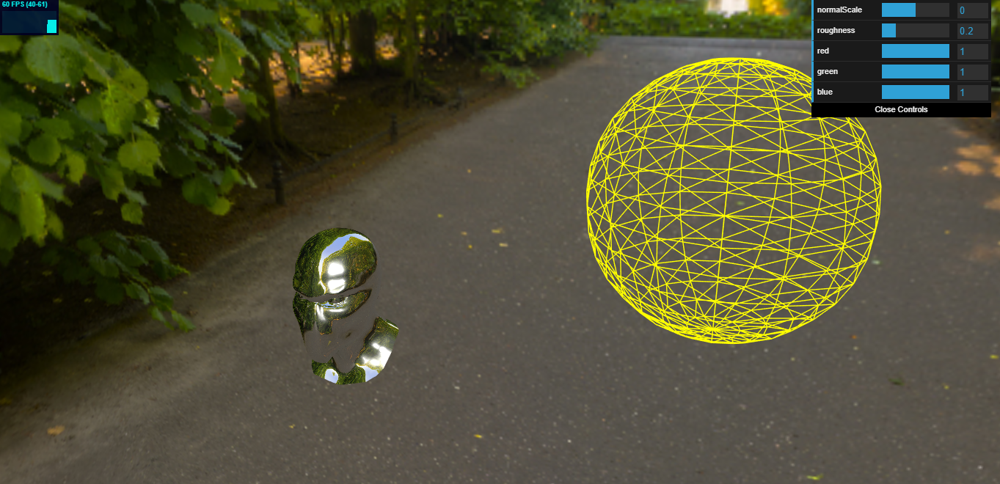
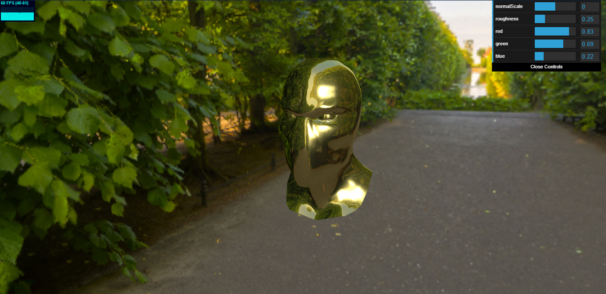
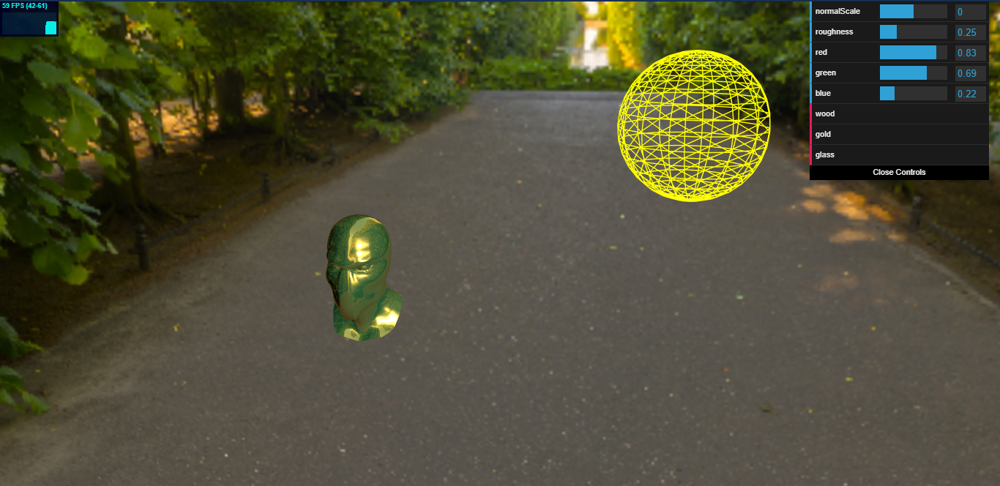
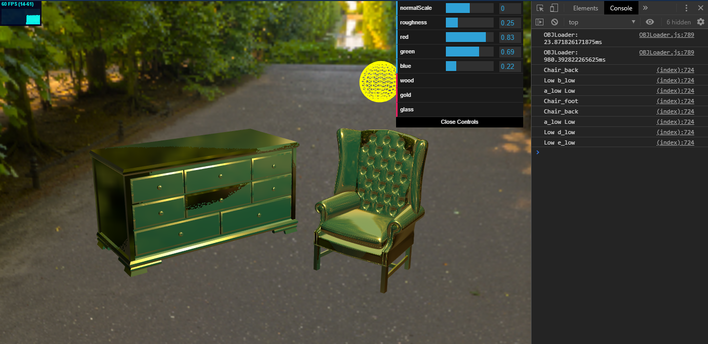
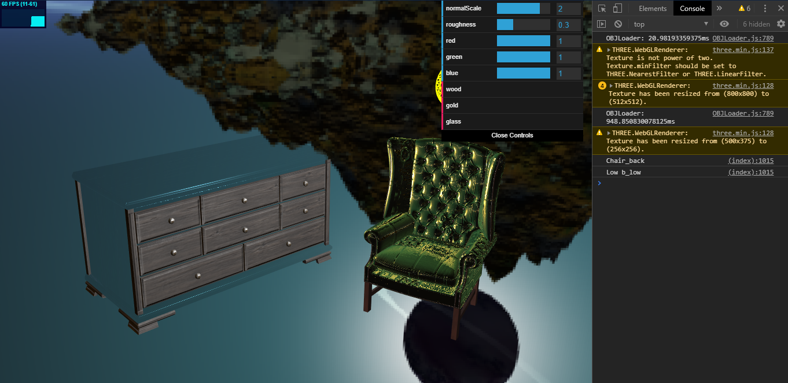
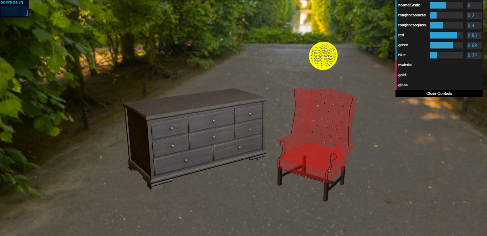

# ProductVisualization project journal

* **07 gennaio 2020**

Inizializzazione del progetto con il file index.html, importazione delle librerie necessarie e primo deploy di un oggetto con shader diffusivo basato su texture.

* **08 gennaio 2020**

Implementazione di shader riflessivo e refrattivo per diverse tipologie di materiali, con riflessi.

* **09 gennaio 2020**

Collegamento dei materiali ad una prima interfaccia per permettere di passare da un tipo di shader all'altro a run time.

* **10 gennaio 2020**

Primo caricamento di oggetti complessi e applicazione degli shader.

* **11 gennaio 2020**

Implementazione della selezione di un oggetto con il mouse tramite click nella scena (tramite Raycaster, nome dell'oggetto selezionato visibile in console). Utilizzo prime texture sui modelli scelti.

* **13 gennaio 2020**

Prima separazione dei componenti, attribuendo i materiali, shader e texture diversi a seconda della selezione.

* **14 gennaio 2020**

Highlight dell'elemento selezionato con MeshBasicMaterial.

* **15 gennaio 2020**

