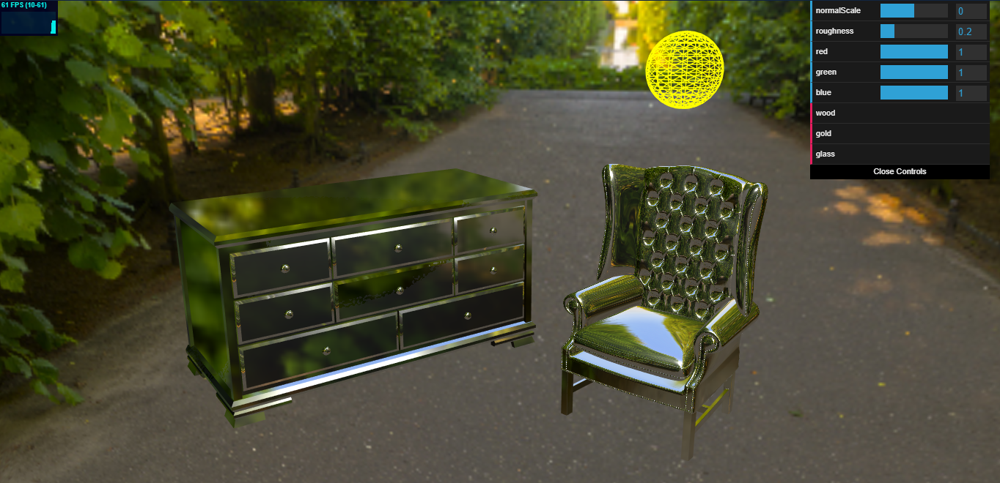

# ProductVisualization project journal

* **07 gennaio 2020**
Inizializzazione del progetto con il file index.html, importazione delle librerie necessarie e primo deploy di un oggetto con shader diffusivo basato su texture.

* **08 gennaio 2020**
Implementazione di shader riflessivo e refrattivo per diverse tipologie di materiali, con riflessi.

* **09 gennaio 2020**
Collegamento dei materiali ad una prima interfaccia per permettere di passare da un tipo di shader all'altro a run time.

* **10 gennaio 2020**
Primo caricamento di oggetti complessi e applicazione degli shader.

* **11 gennaio 2020**
Implementazione della selezione di un oggetto con il mouse tramite click nella scena (tramite Raycaster, nome dell'oggetto selezionato visibile in console). Utilizzo prime texture sui modelli scelti.

* **13 gennaio 2020**
Prima separazione dei componenti, attribuendo i materiali, shader e texture diversi a seconda della selezione.

* **14 gennaio 2020**
Highlight dell'elemento selezionato con MeshBasicMaterial.

* **15 gennaio 2020**
Environment map applicata ad un cubo o ad una sfera per costruire una stanza attorno alla scena.

* **16 gennaio 2020**
Aggiunta di materiali e texture alternativi come opzioni per lo shader.

* **20 gennaio 2020**
Sviluppo di una prima interfaccia per selezionare gli oggetti senza mouse (problemi causati dal resizing del canvas all'interno della finestra).

* **20 gennaio 2020**
Applicazione dei materiali attraverso l'interfaccia html.

* **21 gennaio 2020**
Aggiornamento css e nuova environment map.

* **22 gennaio 2020**
Aggiunta ombre e shadowmap.

* **22 gennaio 2020**
Aggiornamento luci e posizionamento coerente con environment map.

* **22 gennaio 2020**
Nuovi materiali e texture per legno e pelle.

* **24 gennaio 2020**
Nuova interfaccia html e nuovo modello poltrona (più leggero e con meno vertici, per alleggerire il rendering).

* **3 febbraio 2020**
Layout aggiornato tipo sito web e rotazione su se stessi funzionante per gli oggetti.

* **4 febbraio 2020**
Tonemapping per risaltare i mobili come luce in studio.

* **4 febbraio 2020**
Separazione della mesh dei cassetti dal resto della cassettiera, per permettere più personalizzazione.

* **5 febbario 2020**
Nuova prospettiva della camera per miglior visuale, aggiunto un pivot anche per rotazione della poltrona. Aggiunto shader per materiale plastico.

* **28 marzo 2020**
Sistemazione dell'utilizzo delle irradiance map e sostituzione dello sfondo della stanza con un ambiente più neutro tipo studio (gradiente circolare da nero a bianco). Irradiance ed Environment map mantenute per riflessi e illuminazione.

